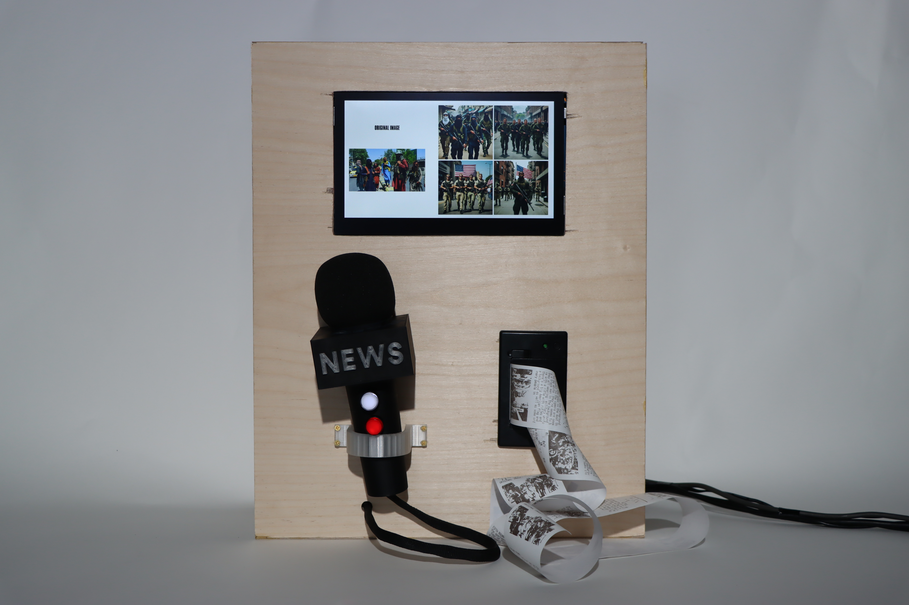

# Layers of Bias
by [Nathan Williams](https://nathanwilliams.space/) and [Pepi Ng](https://pepzicles.com/)

“Layers of Bias” is an interactive physical installation that  explores how different layers of biases - machine learning algorithms, image generation models and human perspectives- affect our intepreation of information in this digital age.

